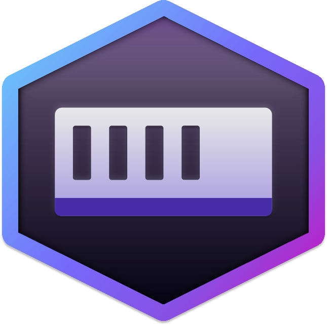

 

  

###

  
  
  

###

  

###

<h1 align="center">✦ Skeptic - Systems ✦</h1>

###

<h3 align="center">✦ I’m a Systemintegrator and Fullstack Dev 
✦ ✦ I have a passion for coding and exploring new technologies. ✦ ✦ Always learning and building cool stuff. ✦</h3>

###

<h2 align="left"></h2>

###

<h3 align="center">✦ Language & Tools ✦</h3>

###

  
  
  
  
  
  
  
  
  
  
  
  
  
  
  
  
  
  
  
  
  
  

###

  
  
  
  
  
  
  
  
  
  
    
  

###

  
  
  
  
  
  
  
  

###

<h2 align="left"></h2>

###

<h3 align="center">✦ STATS ✦</h3>

###

  
  

###

###

<h2 align="left"></h2>

###